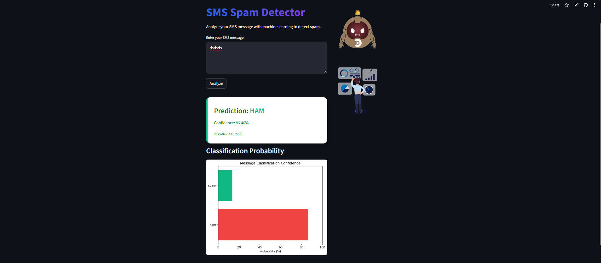

# SMS Spam Detector

A simple and intuitive web application built using Streamlit that classifies SMS messages as Spam or Ham (legitimate) using a Multinomial Naive Bayes classifier. 

## Features

- Machine learning model: Multinomial Naive Bayes
- Text preprocessing and vectorization with CountVectorizer
- Clean user interface built with Streamlit
- Real-time prediction of SMS messages
- Includes model evaluation metrics (accuracy, classification report, confusion matrix)

## Setup Instructions

Follow these steps to run the app locally:

### 1. Clone the repository

git clone https://github.com/YOUR-USERNAME/sms-spam-detector.git
cd sms-spam-detector

### 2. Install dependencies

pip install -r requirements.txt

### 3. Train the model

python train_model.py (optional)

### 4. Run the Streamlit App

streamlit run main.py

## Live Demo 

You can access the deployed app here:
https://sms-spam-detector-abellana-derecho.streamlit.app/

## Screenshot

Here's a preview of tha app:

